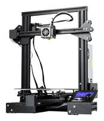

# Máscara protectora

## Introducción

El siguiente manual explica el procedimiento por el cual se realiza la fabricación mediante FDM y el posterior ensamblaje de las máscaras de protección diseñadas por la comunidad Coronavirus Maker en España dentro de la crisis de COVID-19.
Los dispositivos constan de 2 partes: la sujeción (impresa en PLA) y la lámina de protección (lámina de PVC). El autor del diseño es Hanoch Hemmerich.

El objetivo de esta ayuda no es una solución para evitar contagios, sino que su finalidad es alargar la vida de los sistemas EPI homologados del personal sanitario y no sanitario que se halla frente a posibles portadores o infectados, que ya es facilitado por el departamento de Riesgos Laborales de sus respectivas organizaciones.
La lamina utilizada es de PVC de tamaño DINA4 y colocada en formato apaisado (horizontal) con el objetivo de cubrir la cara lo más ampliamente posible.

El sistema de colocación está diseñado para que sea fácil y rápido de colocar y retirar. Así mismo, este sistema permite su ajuste según el perímetro craneal de cada individuo.
Adicionalmente, el presente dispositivo, dispone de 2 ranuras que evitan la formación de vaho por el usuario al respirar, garantizando la máxima visibilidad en todo momento.

Por motivos de bioseguridad, y siguiendo la normativa, este sistema está diseñado para un solo uso. No obstante, puede ser desinfectados mediante métodos químicos bajo el criterio del equipo de Riesgos Laborales. En ningún caso debe esterilizarse por métodos físicos o químicos. En caso de requerir su desinfección, se ha testado con una solución acuosa de hipoclorito sódico al 5%.
Desde Coronavirus Maker insistimos que es criterio del centro la reutilización del dispositivo. Este equipo está diseñado para usar y tirar, a pesar de ser material reciclable.

## Herramientas

1. Impresora Ender 3

## Materiales

Los siguientes enlaces solo son una referencia del material utilizado para la elaboración de las pantallas protectoras.

Lamina frontal
Láminas de PVC tamaño DINA4
  - Láminas de acetato de 180 o 240 micras.
  - Laminas PET de 400 micras
    - Opcionalmente:
      - Láminas de acetato de 180 o 240 micras.
      - Laminas PET de 400 micras
- Correa posterior
  - Goma elástica o similar
  
## Parámetros de impresión

El archivo para su impresión se puede descargar desde el siguiente enlace:

**TEMPORAL**: https://www.thingiverse.com/thing:4233193/

**Los parámetros de impresión solo son una guía de referencia, dado que cada impresora tiene sus propios parámetros para garantizar impresiones optimas.**

- Diámetro del nozzle: 0.4mm
- Altura de capa: 0.28mm
- Relleno: 50%
- Tipo de relleno: Rejilla
- Capas superiores: 4
- Capas inferiores: 2
- Flujo: 80%
- Sin soportes
- Velocidad de impresión:
- Perímetros: 80mm/s
- Perímetros pequeños: 80mm/s
- Perímetros externos: 80mms/s
- Relleno: 80mms/s
- Relleno solido: 80mms/s
- Relleno solido superior: 80mm/s
- Puentes: 80mm/s
- Relleno: 80mm/s
- Recorrido: 180mm/s
  
### Velocidad para movimientos de impresión

- Perímetros: 80 mm/s
- Perímetros pequeños: 80 mm/s
- Perímetros externos: 80 mm/s
- Relleno: 80 mm/s
- Relleno sólido: 80 mm/s
- Relleno sólido superior: 80 mm/s
- Material de soporte: 50 mm/s
- Interfaz de material de soporte: 100%
- Puentes: 80 mm/s

### Material de impresión

- Filamento PLA 1.75 mm

### Archivo para impresión

- https://www.thingiverse.com/thing:4233193/

## Ensamblaje

**Enlace:** https://www.youtube.com/watch?v=xsc1RIfQK8s
