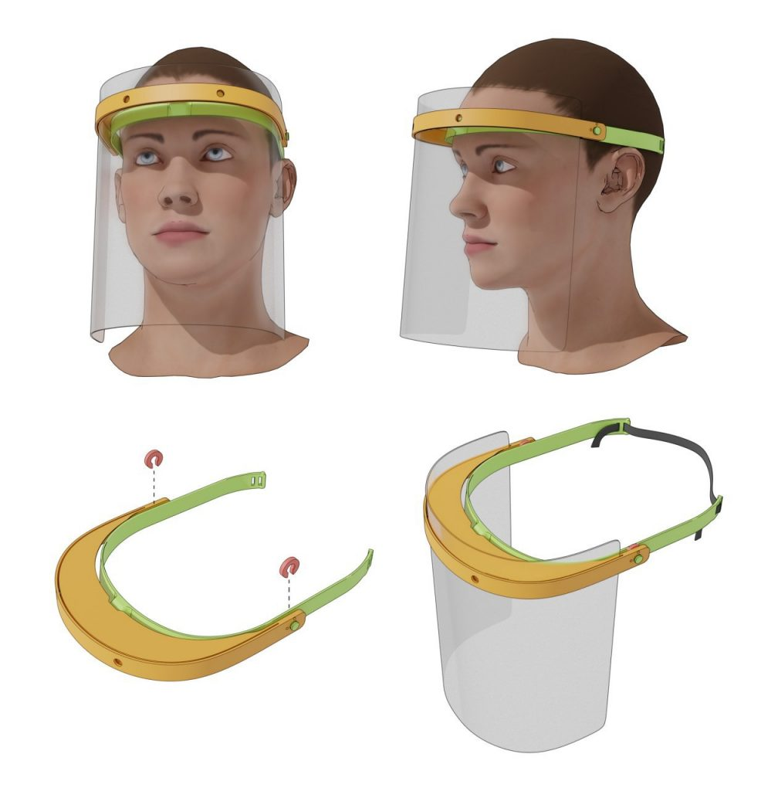

# Visera

## Detalles

Visera

Las viseras se forman con tres partes: el marco impreso, una lámina de PET/PVC para la protección facial y una banda elástica para su ajuste.

Para participar no es necesario que dispongas del PET/PVC ni de la banda elástica.

Te recomendamos que primero hagas la prueba de tolerancia para verificar que tu configuración es la correcta.

Descárgate uno de los dos paquetes disponibles:

* [Impresión Única - Modelo A](./files/modelo-a.zip)
* [Impresión por Partes - Modelo B](./files/modelo-b.zip)

El paquete «impresión única» (A) incluye las dos piezas de la visera en un solo archivo, para imprimir unidas. Tu impresora necesita soportar tolerancias ajustadas para que este archivo funcione correctamente.

El paquete «impresión por partes» (B) lleva el marco de la visera en dos piezas que se unen una vez impresas. Es ideal para impresoras con camas más pequeñas o peores tolerancias. El resultado final de ambos paquetes es el mismo.

Los dos paquetes llevan un archivo extra, con las arandelas que también necesitarás imprimir.

## Opciones de Cura

* Material: PLA850 o PLA 870.
* Altura de capa: 0.25 mm o 0.3 mm.
* Relleno: Entre 15% y 20%.
* Soporte: Solo para los modelo B.
* Support Overhang Angle: 80 grados.
* Tamaño de boquilla de extrusor: 0.4mm o 0.6mm.
* Perímetros:
  * Boquilla Extrusor 0.4 mm : 2
  * Boquilla Extrusor 0.6 mm : 1
* Sujección a la placa: Skirt o Brim (el Brim implica post procesado pero facilita adherencia de las patillas).