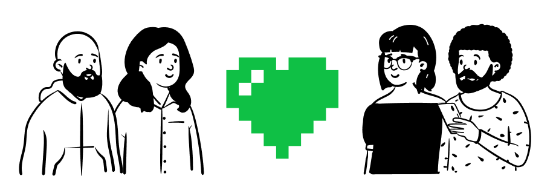

# ¿Cómo ayudar?

## Escribiendo

En esta primera fase, se requieren personas con conocimiento y capacidad de creación que tengan la disposición de capturar y convertir las instrucciones para la eventual construcción del equipo médico que va a ser requerido y escaseará en diferentes partes del mundo durante las olas de los eventos de la pandemia COVID-19.

Se requiere juntar y clasificar la mayor cantidad de información sobre la fabricación de dicho equipamiento para que en una fase posterior esta sea explotada por la mente y las computadoras de millones de personas en búsqueda de diferentes soluciones aplicadas a las necesidades de sus comunidades, entendiendo que estas necesidades cambiarán drásticamente y constantemente por lo que se requerirá el apoyo de la inteligencia  del mundo para resolver el problema.

Requerimos personas con habilidades en:

- Git
- Ingenieros de software
- Médicos
- Enfermeros
- Arquitectos
- Personas que tengan impresora 3D
- Persona con conocimientos en diseño 3D, Autocad, CATIA, Rhinocero, Solidworks
- Técnicos en electrónica

## Revisando

Se requieren personas con el conocimiento y la energía para revisar y filtrar las entradas y correcciones hechas por personas del mundo entero, limpiando y clasificando datos que permitirán tener una fuente confiable de información que podrá ser utilizada para otros medios aún no definidos. 

La labor de los revisores es igual o más importante que la de los escritores ya que no debemos olvidar que lo que se busca distribuir es equipo médico con las especificaciones y calidad necesarias para soportar las extenuantes y peligrosas condiciones a las que será expuesto.