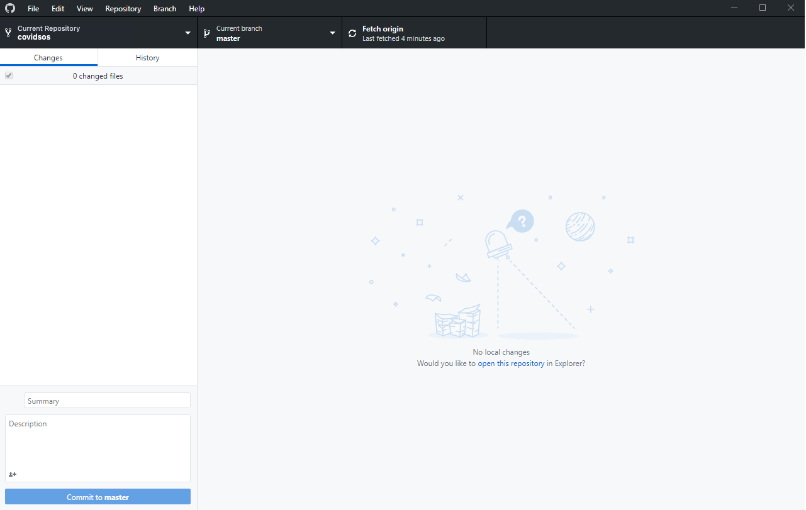
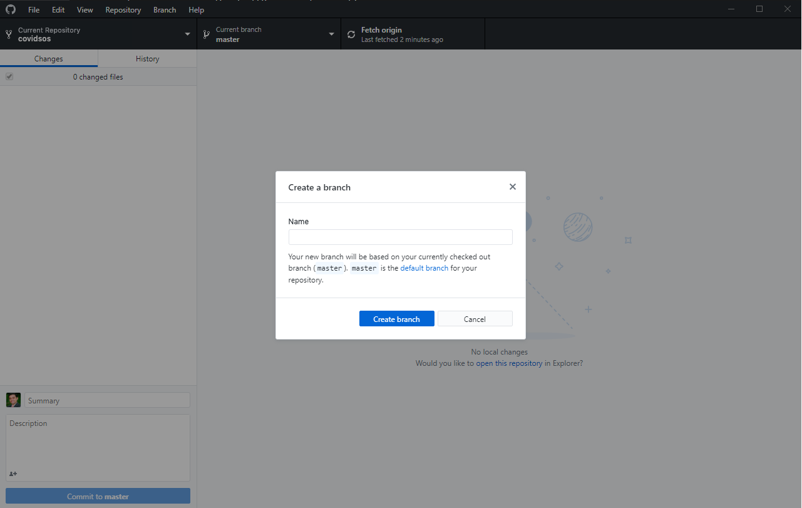
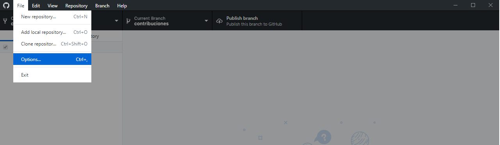

# Primeras Contribuciones

Es complicado. Resulta difícil la primera vez que haces algo, especialmente cuando colaboras con otros, pues cometer errores no es nada agradable. Nuestro objetivo es simplificar la forma en la que los nuevos contribuidores de _codigo abierto_ aprenden y contribuyen por primera vez.

Leer artículos y ver tutoriales puede ayudar, pero, ¿Qué mejor que hacer las cosas en un entorno de prácticas? Este proyecto se enfoca en ser una guía y en simplificar la forma en la que los principiantes hacen su primera contribución. Si quieres hacer tu primera contribución, sigue los pasos que se muestran a continuación.

Si no tienes instalado Github en tu computadora, [instálalo](https://desktop.github.com/). 

## Bifurca (Fork) este repositorio

Haz fork a este repositorio haciendo click en el botón que se encuentra en la parte superior derecha de esta página. Esto creará una una copia de este repositorio en tu cuenta de Github.

## Clona el repositorio

Ahora clona este repositorio en tu computadora.

**IMPORTANTE: NO CLONES EL REPOSITORIO ORIGINAL**. Ve a tu propio fork y clónalo en tu computadora.

Para clonar el repositorio, haz click en "Clone or download" y luego click en "Open in Desktop"

Una ventana emergerá. Haz click en "Open GitHubDesktop.exe".

Después de hacer click en "Open GitHubDesktop.exe" el contenido será descargado a tu computadora.

Ahora ya has descargado el contenido de este repositorio a tu computadora

## Crea un branch

Ahora crea un branch haciendo click en el ícono "Current branch" que se encuentra en la parte superior y haz click en "New branch".

Dale un nombre a tu branch.

Click en `Create branch`

## Haz los cambios necesarios y sube dichos cambios

Ahora abre cualquier archivo en Markdown de este repositorio con el editor de código de tu preferencia. Haz un cambio en el archivo, agrega una porción de texto y guarda tus cambios.

Podrás observar que hay cambios en el archivo y han sido añadidos a tu aplicación de Github.

Ahora haz commit a esos cambios:

Agrega un título descriptivo y una descripción (opcional) a tus ajustes y haz click en el botón `Commit to...`.

En la parte inferior de la pantalla podrás ver que tu commit ha sido creado.

## Haz push a tus cambios hacia Github

Haz click en `File->Options` e inicia sesión en Github.com. Ingresa tu nombre de usuario y contraseña de Github, si aún no tienes una cuenta, crea una.

Haz click en el botón `Publish` en la parte superior derecha.

## Sube tus cambios para que sean revisados

Si te diriges a tu repositorio en github verás el botón `Compare & pull request`, haz click en ese botón.tton.

Ahora envía tu pull request.

Pronto, un colaborador autorizado de Covidsos revisará tus cambios y de ser aprobados serán integrados al repositorio de nuestro proyecto. Recibirás una notificación por correo una vez que haya una acción sobre tus cambios.

## ¿Qué sigue?

¡Felicitaciones! Haz completado esta breve guía con los pasos básicos para colaborar en nuestro proyecto. Ahora solo tienes que unirte a este esfuerzo global, ¡esperamos contar con tu ayuda!.

