# Instalación de Visual Studio Code

Visual Studio Code es un editor multiplataforma con reconocimiento de sintaxis de código y coloreado de una multitud de lenguajes e integración con Git.

Visual Studio Code es un editor ligero no un IDE completo, es decir no es un sustituto del Visual Studio sino que más bien es una herramienta básica para cubrir las necesidades de edición de código simple. Lo más importante de este editor es su gratuidad y que se puede descargar en varias plataformas como Windows, Mac, Linux entre otras.

Para descargar VS Code ingresaremos a la siguiente página https://code.visualstudio.com y haremos clic en "Download"

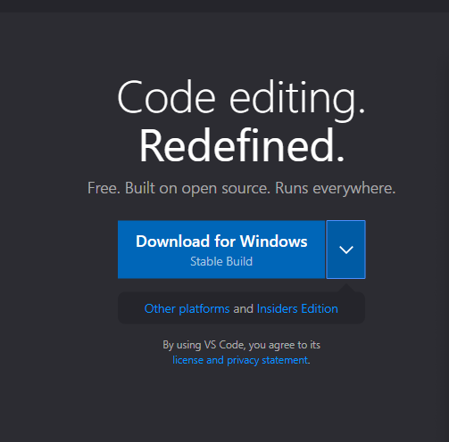

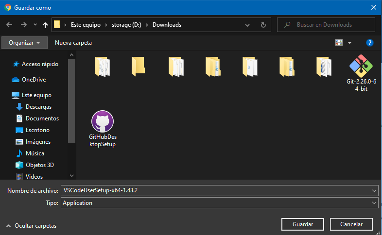

Una vez que se haya descargado el instalador, haremos doble clic para ejecutarlo e instalar VS Code.

Hacemos clic en "Ejecutar".

Aceptamos el acuerdo de licencia y hacemos clic en siguiente.

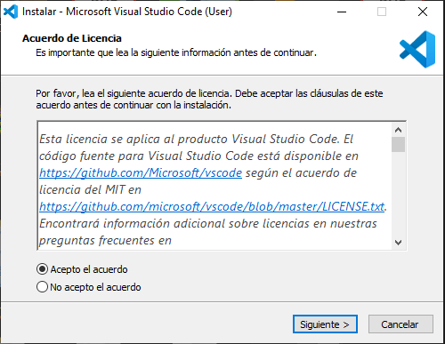

Seleccionamos la carpeta de destino y hacemos clic en siguiente.

Seleccionamos la carpeta de menú de inicio y hacemos clic en siguiente.

Seleccionamos las tareas adicionales y hacemos clic en siguiente.

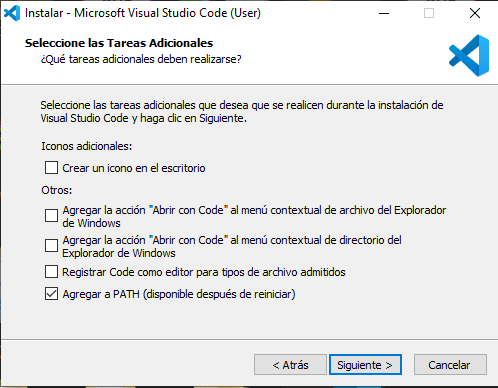

Hacemos clic en instalar.

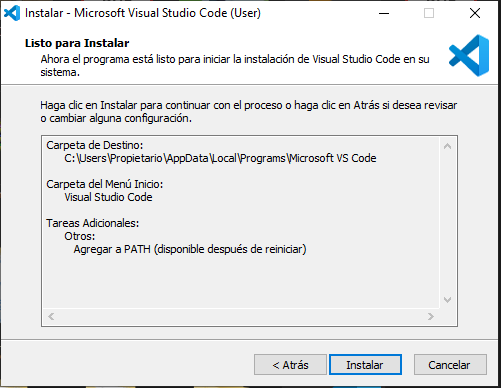

A continuación hacemos clic en finalizar.

## Como abrir un repositorio con Visual Studio Code

Para abrir los archivos de un repositorio o de un proyecto en VS Code, debemos hacer clic en "File" y seleccionar "Open Folder..." y seleccionar la carpeta del repositorio. 

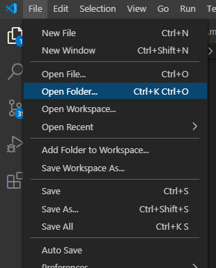

Una vez abierta la carpeta se mostrara en el panel izquierdo los archivos que contiene.

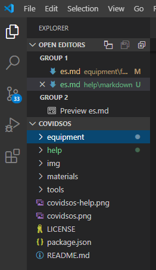

# ¿Qué es Markdown?

Markdown es “una herramienta de conversión de texto a HTML”, creada por John Gruber con el objetivo de ayudarte a concentrar en la escritura en vez de en el formato del documento.

Al utilizar la sintaxis de Markdown, serás capaz de producir archivos que pueden ser legibles como texto plano y que a la vez están listos para ser formados en otras plataformas. Muchos generadores de bitácoras y de sitios estáticos, así como sitios como GitHub, también aceptan Markdown y traducen estos archivos a HTML para su visualización en la web. 

## Aprende en cinco minutos

Como los documentos de Markdown son documentos de texto simple, puedes usar cualquier editor de texto para crear, editar y guardar un documento. Es decir, puede escribir estilo Markdown en Sublime Text, Atom, Vim, Visual Studio, Brackets, Notepad++ o cualquier otro editor de texto que prefieras. Sólo recuerda una regla primordial: debes guardar el documento con la extensión de archivo punto md o punto markdown. Así: nombredearchivo.md o bien nombredearchivo.markdown.

### Bloque de código con sintaxis resaltada

# Título 1 o h1
## Título 2 o h2
### Título 3 o h3
#### Título 4 o h4
##### Título 5 o h5
###### Título 5 o h6

- Lista
- Con viñetas

1. Lista
2. Numerada

**Negritas**

*Itálica*

***Itálica & negritas juntas***

`Código`

Línea horizontal
*******

> Cita o bloque de cita

[Enlace] (url)

Para añadir una imagen: ¡[Imagen](fuente de la imagen, una url)

# Como instalar la extensión "Markdown All in One" en Visual Studio Code

Para facilitar el uso de Markdown utilizaremos la extensión “Markdown All in One” la cual instalaremos en VS Code siguiendo los siguientes pasos.

Para instalar "Markdown All in One" en VS Code, haremos clic en el ícono de "Extensions" o si nos encontramos en Windows 10 podemos utilizar las teclas "Ctrl+Shift+X", al hacer esto se desplegará del lado izquierdo un buscador donde realizamos la siguiente búsqueda "Markdown All in One", una vez encontrada la extensión haremos clic en "Install".

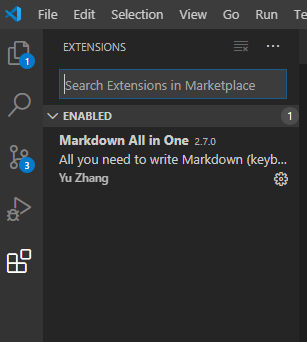

Cuando se termine de realizar la instalación procederemos a crear nuestro primer archivo con sintaxis Markdown.

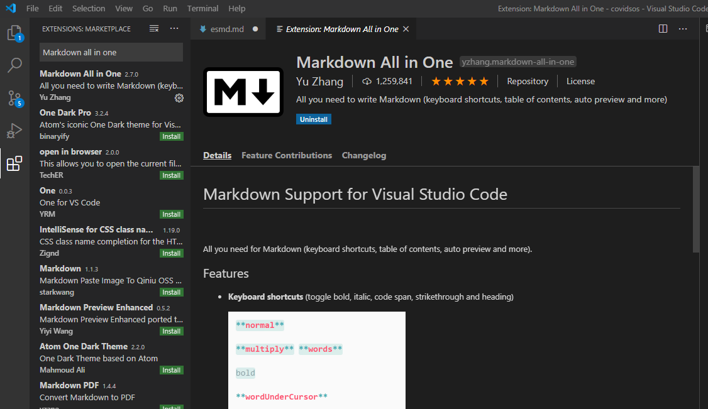

## Como crear un archivo Markdown

Seleccionamos una carpeta donde vayamos a guardar nuestro archivo Markdown y hacemos clic derecho sobre la carpeta, seleccionamos "New file" e indicamos el nombre del archivo. 

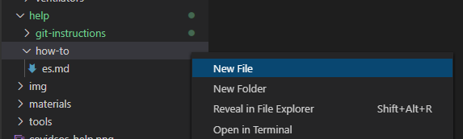

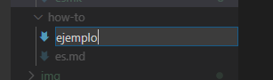

Una vez que hemos creado el archivo, en la parte inferior derecha de la pantalla vamos a cambiar el tipo de lengua del archivo, para esto hacemos clic en “Plaint text” y a continuación se mostrara una pantalla emergente donde realizaremos una búsqueda. 

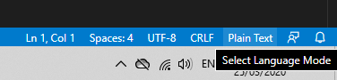

Al hacer clic sobre el lenguaje Markdown el archivo se configura automáticamente y lo podemos comprobar mirando la parte inferior derecha de la pantalla, donde anteriormente se mostraba el texto Plaint text ahora podemos ver el texto Markdown.

¡Listo! ahora podremos empezar a editar nuestro archivo utilizando Markdown.