# Como instalar Visual Studio Code

Visual Studio Code es un editor multiplataforma con reconocimiento de sintaxis de código y coloreado de una multitud de lenguajes e integración con Git.

Para descargar VS Code, ingresa a [code.visualstudio](https://code.visualstudio.com) y haz clic en "Download".

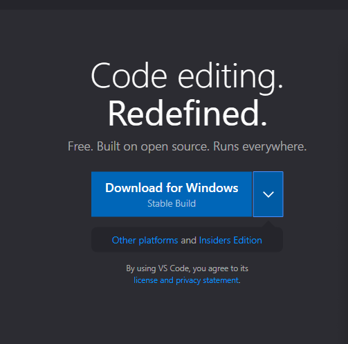

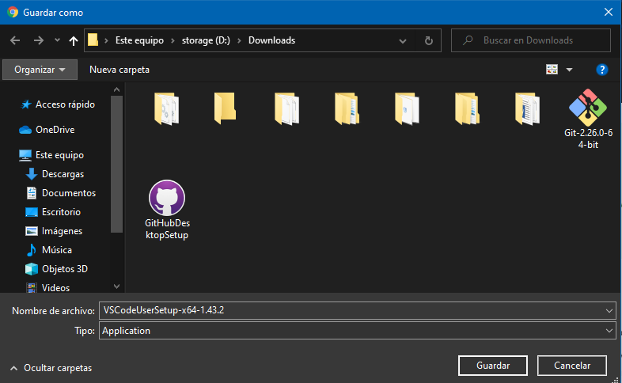

Una vez que se haya descargado el instalador, haz doble clic para instalarlo. Posteriormente, haz clic en "Ejecutar".

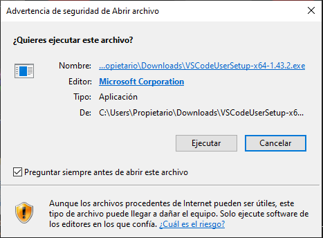

Acepta el acuerdo de licencia y da clic en "Siguiente".

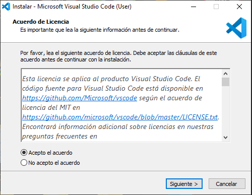

Selecciona la carpeta de destino y da clic en "Siguiente".

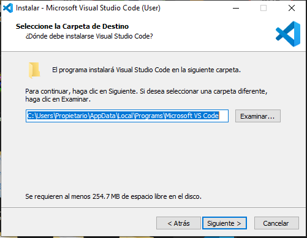

Selecciona la carpeta de "Menú de inicio" y da clic en "Siguiente".

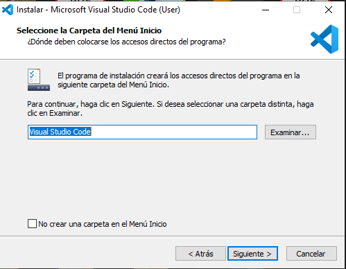

Selecciona las tareas adicionales y da clic en "Siguiente".

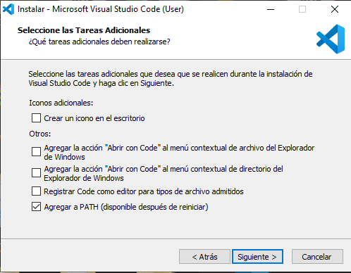

Haz clic en "Instalar".

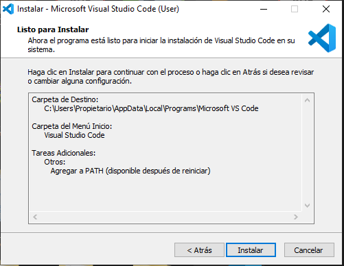

Da clic en "Finalizar".

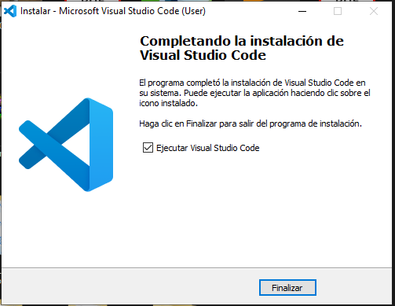

## Como abrir un repositorio con Visual Studio Code

Para abrir los archivos de un repositorio o de un proyecto en VS Code, haz clic en "File", seleccionar "Open Folder..." y posteriormente, la carpeta del repositorio. 

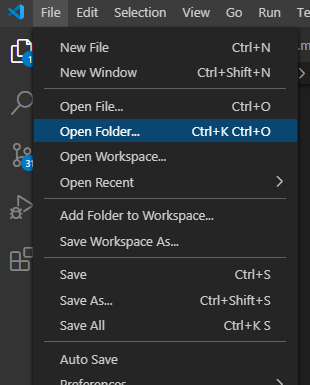

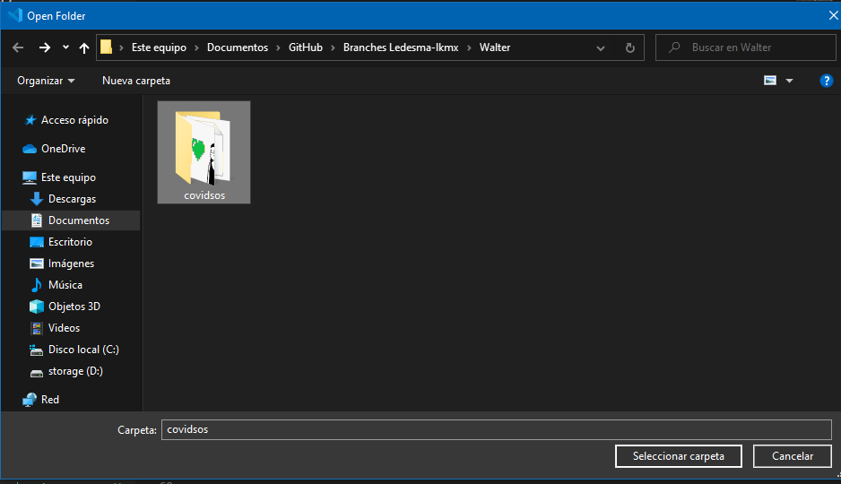

Una vez abierta la carpeta, se mostrará en el panel izquierdo los archivos que contiene.

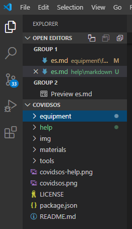

## Como instalar la extensión "Markdown All in One" en Visual Studio Code

Para facilitar el uso de Markdown recomendamos que se utilicé la extensión “Markdown All in One” la cual instalaremos en VS Code siguiendo los siguientes pasos.

Para instalar "Markdown All in One" en VS Code, haz clic en el ícono "Extensions" (si tu sistema operativo es Windows 10, utiliza las teclas "Ctrl+Shift+X"). Se desplegará del lado izquierdo un buscador, en ella escribe "Markdown All in One". Una vez encontrada la extensión, da clic en "Install".

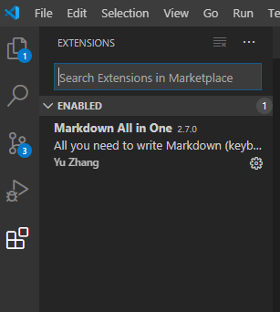

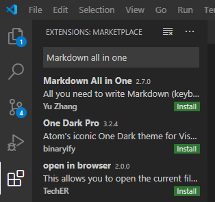

Cuando se termine de realizar la instalación procederemos a crear nuestro primer archivo con lenguaje Markdown.

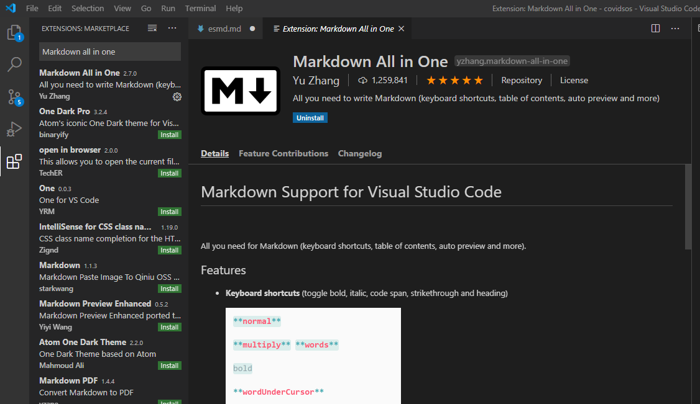

## Crear un archivo con lenguaje Markdown

Seleccionaremos una carpeta donde vayamos a guardar nuestro archivo y hacemos clic derecho sobre la carpeta, seleccionamos "New file" e indicamos el nombre del archivo. 

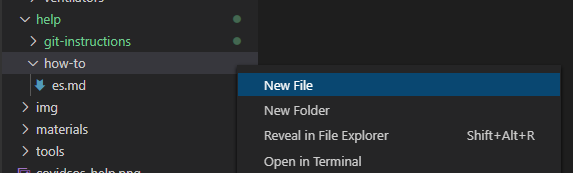

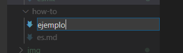

Una vez creado el archivo, cambia el tipo de lengua. Para ello, en la parte inferior derecha de la pantalla, da clic en “Plain Text”; posteriormente se mostrará una pantalla emergente donde realizaremos una búsqueda. 

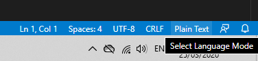

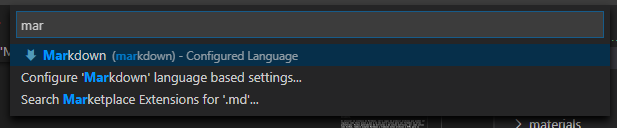

Al hacer clic sobre el lenguaje Markdown, el archivo se configura automáticamente y lo puedes comprobar mirando la parte inferior derecha de la pantalla. Donde anteriormente se mostraba el texto "Plain Text", ahora puedes ver el texto Markdown.

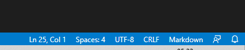

¡Listo! ahora podrás empezar a editar el archivo utilizando Markdown.